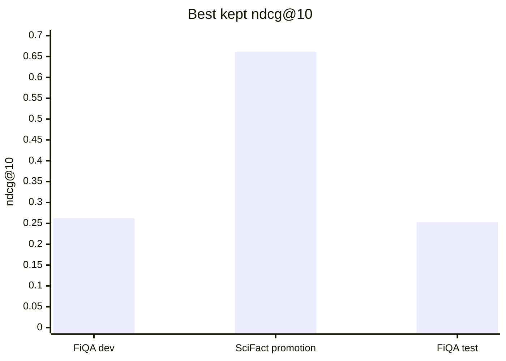
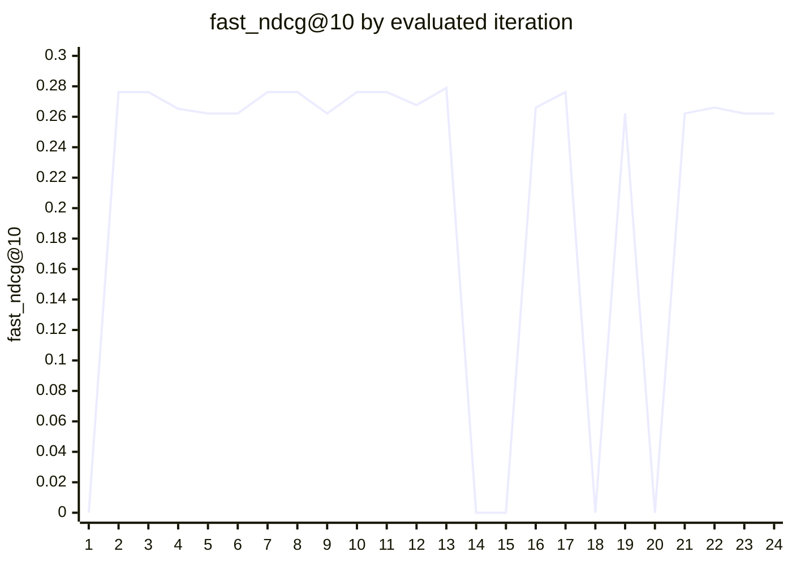

# Autoresearch for Reranking

This repo adapts `karpathy/autoresearch` to offline document reranking. The agent can edit only `rerank_strategy.py`; the datasets, qrels, metrics, evaluator, and benchmark artifacts stay frozen.

The current MVP is a local, git-native loop for testing reranking strategy changes against fixed IR benchmarks. It uses `ir_datasets`, `ir_measures`, Sentence Transformers `CrossEncoder`, and the fixed reranker `BAAI/bge-reranker-base`.

## Results

Result history reviewed:

- `history/results-summary.csv`: 101 benchmark summary rows
- Status counts: 16 `keep`, 72 `discard`, 13 `crash`
- `history/iterations.csv`: 91 autonomous iterations
- Iteration outcomes: 43 `discard`, 41 `brain_error`, 7 `crash`

Best kept results:

| Benchmark | Purpose | `ndcg@10` | `recall@100` | `mrr@10` | `latency_p95_ms` | Status |
|---|---|---:|---:|---:|---:|---|
| `fast-fiqa-dev` | fast tuning loop | 0.262157 | 0.469997 | 0.336499 | 1345.105 | `keep` |
| `promotion-scifact` | promotion check | 0.661389 | 0.859222 | 0.638659 | 887.763 | `keep` |
| `report-fiqa-test` | held-out report | 0.252578 | 0.477335 | 0.334911 | 776.991 | `keep` |



Evaluated FiQA dev iterations:



`0.262157` is the current kept FiQA dev BGE-base baseline. Iterations above it were still discarded when repeat, latency, memory, or promotion checks failed.

Kept checkpoint steps:

| Step | Kept checkpoint | Benchmark | `ndcg@10` | Why it was kept |
|---:|---|---|---:|---|
| 1 | `fiqa-dev-bge-base-baseline` | `fast-fiqa-dev` | 0.262157 | fast-loop BGE-base baseline |
| 2 | `promotion-scifact-bge-base-baseline` | `promotion-scifact` | 0.661389 | promotion BGE-base baseline |
| 3 | `fiqa-test-bge-base-baseline` | `report-fiqa-test` | 0.252578 | held-out report BGE-base baseline |

Strong raw results that were not kept:

| Strategy | Benchmark | `ndcg@10` | Status | Reason |
|---|---|---:|---|---|
| `shorter-truncation-policy` | `fast-fiqa-dev` | 0.278969 | `discard` | promotion benchmark rejected candidate |
| `shorter-truncation-policy/promotion` | `promotion-scifact` | 0.679487 | `discard` | guardrail regression |
| `improve-rerank-score` | `diverse-nano` | 0.092585 | `discard` | guardrail regression |

## Findings

- The fixed `BAAI/bge-reranker-base` baseline is the best accepted strategy so far.
- `candidate_k` and `truncation_policy` produced the strongest raw `ndcg@10` movement.
- `fusion_weight` and `score_normalization` produced weaker accepted signal in the current history.
- Many loop failures were `brain_error`, where the controller produced invalid `rerank_strategy.py` code or unsupported strategy keys.
- The keep policy rejected several high-`ndcg@10` runs because they failed latency, memory, repeat-run, or promotion checks.

## Metric Policy

The primary metric is `ndcg@10` on frozen `beir/fiqa/dev`.

A candidate can be kept only if:

- `ndcg@10` improves by at least `0.002`
- `recall@100` regresses by no more than `1%` relative
- `latency_p95_ms` regresses by no more than `20%` relative
- `peak_memory_mb` regresses by no more than `20%` relative
- `cost_usd` does not increase
- the run completes without crash, timeout, malformed ranking output, or missing metrics
- the candidate survives two repeated dev runs
- when configured, the candidate survives `beir/scifact/test` promotion

`mrr@10` is diagnostic only.

## Benchmarks

| Path | Dataset | Use |
|---|---|---|
| `artifacts/fast/fiqa-dev/` | `beir/fiqa/dev` | fast tuning |
| `artifacts/promotion/` | `beir/scifact/test` | promotion validation |
| `artifacts/report/` | `beir/fiqa/test` | held-out reporting |

The evaluator uses a 10-minute budget for the fast loop and a 25-minute budget for promotion or report checks.

## How It Works

1. `prepare.py` builds frozen benchmark artifacts.
2. `autoresearch_driver.py` packages recent results, prompt context, and the strategy surface.
3. `local_brain.py` proposes a bounded change to `rerank_strategy.py`.
4. `proposal_validator.py` checks family, novelty, changed keys, and expected tradeoffs.
5. `train.py` evaluates the strategy through `strategy_runner.py` and `strategy_worker.py`.
6. `run.py` records `keep`, `discard`, or `crash`.
7. `history_report.py` exports `history/results-summary.csv`, `history/iterations.csv`, and `history/index.html`.

The controller uses [docs/reranking_playbook.md](docs/reranking_playbook.md) plus recent run history. The inner loop does not use live web search.

## Strategy Surface

`rerank_strategy.py` supports these mechanism slots:

- `candidate_k`
- `score_normalization`
- `fusion_weight`
- `metadata_boost`
- `dedup_filter`
- `truncation_policy`
- `pre_rerank_filter`
- `query_type_heuristic`

The controller model used locally is `Qwen3-8B-Q4_K_M.gguf` through `llama_cpp`.

## Quick Start

```bash
uv sync
uv run autoresearch-reranking prepare
uv run autoresearch-reranking baseline
```

Run one iteration:

```bash
uv run autoresearch-reranking once
```

Run five iterations:

```bash
uv run autoresearch-reranking loop 5
```

Refresh the history dashboard:

```bash
uv run autoresearch-reranking history
```

Manual checks:

```bash
uv run train.py --artifact-dir artifacts/fast/fiqa-dev --split dev
uv run train.py --artifact-dir artifacts/promotion --split dev
uv run train.py --artifact-dir artifacts/report --split dev
```

## Outputs

- `results.tsv`: experiment registry
- `runs/`: prompts, responses, metrics, and decisions
- `history/results-summary.csv`: benchmark summary rows
- `history/iterations.csv`: autonomous iteration rows
- `history/index.html`: local history dashboard

## Kaggle

The Kaggle path runs the same loop on a two-T4 notebook with query-sharded evaluation:

```bash
uv run autoresearch-reranking-kaggle package-source
uv run autoresearch-reranking-kaggle package-artifacts
```

```bash
python kaggle_kernel.py \
  --source-archive /kaggle/input/datasets/<owner>/autoresearch-reranking-source \
  --artifacts-archive /kaggle/input/datasets/<owner>/autoresearch-reranking-artifacts \
  loop 3
```
