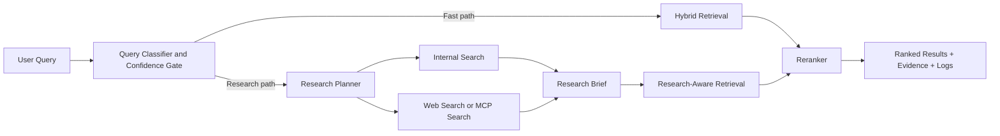

# Auto Research Functionality for Reranking

Superseded for this repository's current MVP. The active implementation target is the narrow offline autoresearch loop in `docs/deep-research-report.md`, not the broader research-aware product architecture described below.

Updated: 2026-03-29

Status: greenfield project brief

Local context: this workspace did not contain an existing codebase, README, or design notes when reviewed on 2026-03-29. This document defines the project we can build from scratch.

## 1. Problem Statement

Standard retrieval and reranking pipelines work well for direct queries, but they degrade on:

- ambiguous queries
- multi-hop or exploratory queries
- time-sensitive queries
- queries that need external context before internal documents can be judged correctly

The project goal is to add an **auto research layer** before reranking so the system can gather missing context, produce better candidate sets, and rerank against the actual user intent instead of the raw query text alone.

## 2. Working Definition

For this project, **auto research** means a bounded pre-rerank workflow that can:

- classify the query difficulty and freshness sensitivity
- rewrite or expand the query into better retrieval variants
- extract entities, constraints, and metadata filters
- search approved sources such as internal knowledge bases and optionally the web
- synthesize a compact research brief
- pass that brief into the retrieval and reranking stages

The system should not default to expensive research on every query. It should use a fast path for easy queries and a research path only when the query or the first retrieval pass shows low confidence.

## 3. Product Goals

- Improve relevance for difficult queries without hurting easy-query latency.
- Increase top-rank quality using research-aware reranking.
- Support freshness when the query clearly depends on recent information.
- Preserve traceability with evidence and source attribution for ranking decisions.
- Keep the architecture modular so we can swap hosted and open-source rankers later.

## 4. Non-Goals for V1

- training a custom reranker from scratch
- building a general-purpose crawler
- solving final answer generation UX
- supporting every external data source at launch
- fully autonomous long-running research without cost and latency limits

## 5. Target System Behavior

The intended behavior is:

1. Accept a user query and context.
2. Decide whether the query should use the fast path or the research path.
3. Produce a structured research brief for hard queries.
4. Retrieve candidate documents from internal and approved external sources.
5. Rerank the candidates using the original query plus the research brief.
6. Return ranked results with scores, evidence, and enough metadata for offline evaluation.

## 6. Recommended Product Shape

### Fast path

Use this for short, direct, high-confidence queries.

- query normalization
- hybrid retrieval against internal corpus
- rerank top 25 to 100 candidates
- return ranked results

### Research path

Use this for ambiguous, multi-step, or freshness-sensitive queries.

- classify query intent
- generate rewritten queries and subqueries
- extract entities, temporal constraints, and metadata filters
- search internal corpus first
- search the web only if allowed and needed
- synthesize a compact research brief
- retrieve candidates again using the improved queries
- rerank using query plus research context

This split is important because deep research is too slow and expensive to be the default path for every request.

## 7. Architecture Recommendation



### Core services

- API layer: `FastAPI`
- orchestration: async workers plus queues; use `Temporal`, `Celery`, or a simple background job layer in the MVP
- vector and hybrid retrieval: `Qdrant`
- relational metadata store: `Postgres`
- cache and queue support: `Redis`
- observability: `OpenTelemetry` plus request and ranking traces

### Why Qdrant is a good default

Qdrant’s official hybrid search guide shows dense, sparse, and late-interaction reranking in the same retrieval stack, which fits this project well.

## 8. Research and Ranking Stack Options

### Recommended MVP stack

Use hosted services first so we can learn quickly:

- planner model: `gpt-5.4`, `gpt-5-mini`, or `o3` for structured query analysis
- research model: `o4-mini-deep-research` for most research jobs
- high-value research fallback: `o3-deep-research`
- initial reranker: hosted API such as `Cohere Rerank` or `Voyage reranker`
- vector store: `Qdrant`

### Why not use deep research models for every control-plane step

As of the OpenAI docs reviewed on 2026-03-29:

- deep research models support web search, file search, remote MCP, and code interpreter
- they do **not** support function calling
- they do **not** support structured outputs

That means they are strong as async research workers, but not ideal as the only model in a tightly structured request pipeline. For the production control plane, keep a standard reasoning model in front of them or build the research planner with normal tool orchestration.

### Open-source fallback stack

If we want lower variable cost or self-hosting later:

- embeddings and reranking: `Qwen3 Embedding` and `Qwen3 Reranker`
- alternative reranker: `BAAI/bge-reranker-v2-m3`
- late interaction option for top-K: `ColBERT`

The Qwen3 Embedding paper reports public reranker sizes at `0.6B`, `4B`, and `8B`, which gives a usable cost-performance ladder.

## 9. Retrieval Strategy

The retrieval layer should be hybrid from the start:

- sparse retrieval for exact terms and entity precision
- dense retrieval for semantic recall
- metadata filtering where available
- optional late-interaction rerank for the final short list

### Recommended retrieval flow

1. Run sparse and dense retrieval in parallel.
2. Fuse or merge into a candidate pool.
3. If the query was gated into research mode, rerun retrieval using the rewritten query set.
4. Deduplicate candidates by canonical document ID and chunk lineage.
5. Rerank the final candidate pool.

## 10. What the Research Brief Should Contain

The reranker should not receive raw chain-of-thought. It should receive a compact, structured artifact like:

```json
{
  "canonical_query": "",
  "query_variants": [],
  "entities": [],
  "time_constraints": [],
  "metadata_filters": {},
  "source_preferences": [],
  "evidence_snippets": [],
  "research_confidence": 0.0,
  "freshness_required": false
}
```

### Minimum fields

- canonical query
- query variants and subqueries
- extracted entities
- temporal and domain constraints
- approved source list
- short evidence snippets with URLs or document IDs
- confidence score

## 11. Gating Logic

The most important product decision is **when** to trigger research.

### Trigger research when

- the query contains temporal intent such as "latest", "recent", or a date range
- the query is long, ambiguous, or multi-part
- sparse and dense retrieval disagree heavily
- the top retrieval scores are flat or low confidence
- the first pass fails to find enough high-quality candidates
- the query likely requires joining internal context with external context

### Stay on fast path when

- the query is direct and high confidence
- the first retrieval pass already has a strong top result cluster
- the domain forbids external research
- latency budget is tight and the query does not justify escalation

## 12. Reranking Strategy

### Recommended V1 approach

- retrieve top 50 to 100 candidates
- rerank top candidates with a hosted cross-encoder API
- include the canonical query and short research brief as additional context

### Recommended V2 approach

- add late interaction reranking such as `ColBERT` for top 20 to 50
- reserve LLM-based listwise reranking for a very small number of hardest queries

### Important design rule

Reranking cannot recover documents that were never retrieved. The research stage must improve **candidate recall** first, then ranking precision.

## 13. Data Model We Need

At minimum, store:

- `query_id`
- raw query
- canonical query
- query class
- trigger reason for research
- research brief version
- source hits and citations
- candidate document IDs before reranking
- reranked results with scores
- latency per stage
- cost per stage
- feedback and relevance labels when available

This is necessary for both debugging and offline evaluation.

## 14. Evaluation Plan

We should not ship this feature without a labeled evaluation set.

### Offline dataset

Create a gold set of at least:

- 300 to 500 queries for initial evaluation
- a mix of easy, ambiguous, multi-hop, and freshness-sensitive queries
- document-level relevance labels
- optional snippet-level evidence labels

### Core metrics

- `NDCG@10`
- `MRR@10`
- `Recall@50`
- `Precision@5`
- latency: `p50`, `p95`, `p99`
- cost per query
- research trigger rate

### Experiment ladder

- baseline hybrid retrieval only
- hybrid retrieval plus reranker
- hybrid retrieval plus query rewrite
- gated auto research plus reranker
- gated auto research plus late interaction rerank

### External benchmark guidance

Use `BEIR`-style evaluation methodology for offline benchmarking discipline. BEIR specifically highlights that reranking and late-interaction methods are strong zero-shot baselines, but they cost more than dense or sparse retrieval alone.

## 15. Risks and Failure Modes

### Product risks

- research rewrites the query away from user intent
- web evidence introduces noise or low-trust content
- the system becomes too slow for interactive search
- expensive research is triggered too often
- the retrieval stage still misses relevant documents

### Engineering risks

- deep research workers are hard to normalize into structured artifacts
- hosted model outputs drift over time if prompts are weak
- ranking logs become too sparse to debug failures
- no gold labels means we optimize on anecdotes

### Mitigations

- use explicit gating and budget limits
- prefer trusted domains and internal sources first
- keep research brief schema small and testable
- log every stage
- build offline evaluation before rollout

## 16. MVP Build Plan

### Phase 0: framing and measurement

- define corpus boundaries
- define approved source policy
- create the gold evaluation set
- define latency and cost budgets

### Phase 1: retrieval baseline

- ingest corpus into `Qdrant`
- implement sparse plus dense hybrid retrieval
- add a hosted reranker
- measure baseline metrics

### Phase 2: research planner

- add query classifier and trigger rules
- implement query rewrite and subquery generation
- synthesize research brief
- rerun retrieval using rewritten queries

### Phase 3: research-aware reranking

- pass research brief into reranking requests
- compare against baseline on the labeled set
- harden source filtering and evidence attribution

### Phase 4: hardening

- caching
- observability
- budget enforcement
- fallback behavior
- human feedback loop

## 17. API Surface to Plan For

### Core endpoints

- `POST /search`
- `POST /research/preview`
- `POST /eval/run`
- `POST /feedback/relevance`

### Suggested `POST /search` response shape

```json
{
  "query_id": "",
  "mode": "fast|research",
  "canonical_query": "",
  "results": [],
  "evidence": [],
  "stage_metrics": {},
  "cost": {}
}
```

## 18. Open Questions That Block Implementation Quality

We can start building before every answer is known, but these questions materially affect the architecture:

- What corpus are we ranking: internal docs, support tickets, papers, products, code, or mixed content?
- Is external web research allowed, required, or forbidden?
- What is the interactive latency SLA: under 2 seconds, under 5 seconds, or async background completion?
- Do we rank full documents, chunks, snippets, or entity cards?
- Is freshness critical for every query or only a subset?
- Do we have relevance labels or click data already?
- Which languages must the system support?
- Do we need tenant isolation and per-tenant source controls?
- Is this a search API, an internal analyst tool, or a RAG subsystem feeding answer generation?

## 19. Recommended First Build Decisions

If we start implementation now with minimal uncertainty, I recommend:

- `Python + FastAPI`
- `Qdrant` for hybrid retrieval
- a hosted reranker first
- `o4-mini-deep-research` only as a gated async worker
- a standard reasoning model for the planner and structured outputs
- a strict offline eval set before any production rollout

This gets us to a working MVP quickly without locking us into a heavy self-hosted stack too early.

## 20. Source Notes

These sources were checked on 2026-03-29 and informed the recommendations above:

- OpenAI deep research guide: <https://developers.openai.com/api/docs/guides/deep-research>
- OpenAI model catalog: <https://developers.openai.com/api/docs/models>
- OpenAI file search guide: <https://developers.openai.com/api/docs/guides/tools-file-search>
- OpenAI `o3-deep-research` model page: <https://developers.openai.com/api/docs/models/o3-deep-research>
- OpenAI `o4-mini-deep-research` model page: <https://developers.openai.com/api/docs/models/o4-mini-deep-research>
- Cohere rerank docs: <https://docs.cohere.com/v2/docs/rerank>
- Voyage reranker docs: <https://docs.voyageai.com/docs/reranker>
- Qdrant hybrid search with reranking: <https://qdrant.tech/documentation/advanced-tutorials/reranking-hybrid-search/>
- ColBERT paper: <https://arxiv.org/abs/2004.12832>
- BEIR paper: <https://arxiv.org/abs/2104.08663>
- HyDE paper: <https://arxiv.org/abs/2212.10496>
- Qwen3 Embedding and Reranking paper: <https://arxiv.org/abs/2506.05176>
